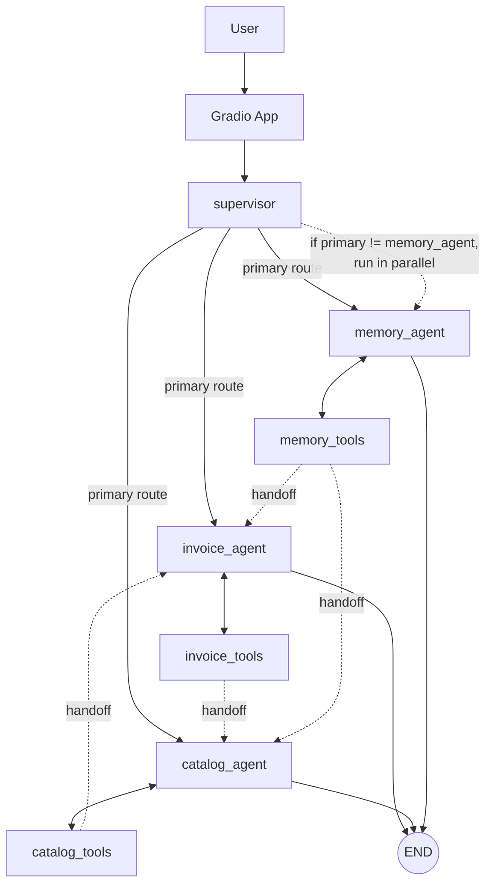
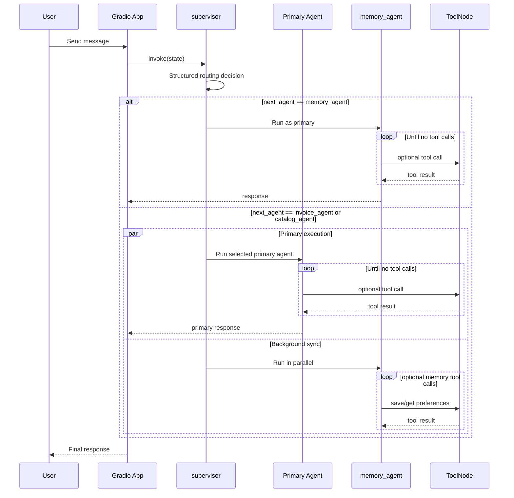

# Chinook Customer Support Agent

## Agent Architecture Diagram



Image version: [docs/agent-architecture-diagram.svg](docs/agent-architecture-diagram.svg)

## Request Execution Diagram



Image version: [docs/request-execution-flow.svg](docs/request-execution-flow.svg)

## Quick Start

1. Clone and enter the repository.

```bash
git clone https://github.com/kansaram/chinook-customer-support-agent.git
cd chinook-customer-support-agent
```

2. Create a Python 3.12 virtual environment.

```bash
py -3.12 -m venv .venv
```

3. Activate the environment.

Windows PowerShell:

```powershell
.\.venv\Scripts\Activate.ps1
```

macOS/Linux:

```bash
source .venv/bin/activate
```

4. Install dependencies.

```bash
pip install -r requirements.txt
```

5. Configure environment variables.

```bash
cp .env.example .env
```

Add your `OPENAI_API_KEY` to `.env`.

## Run The App

From the project root:

```bash
python src/chinook_agent/app.py
```

Default URL: `http://127.0.0.1:7860`

Optional server overrides:

- `GRADIO_SERVER_NAME`
- `GRADIO_SERVER_PORT`

Example:

```powershell
$env:GRADIO_SERVER_NAME="0.0.0.0"
$env:GRADIO_SERVER_PORT="7860"
python src/chinook_agent/app.py
```

## Verify Local Databases

List tables:

```bash
python -c "import sqlite3; c = sqlite3.connect('data/chinook.db'); print(c.execute('SELECT name FROM sqlite_master WHERE type=\"table\"').fetchall())"
```

Check customer count:

```bash
python -c "import sqlite3; c = sqlite3.connect('data/chinook.db'); print(c.execute('SELECT COUNT(*) FROM customers').fetchone())"
```

## Run Tests

```bash
pytest tests/ -v
```

## Docker

Build image:

```bash
docker build -t chinook-customer-support-agent .
```

Run container:

```bash
docker run -d -p 7860:7860 --name chinook-customer-support-agent --env-file .env chinook-customer-support-agent
```

Open: `http://localhost:7860`


