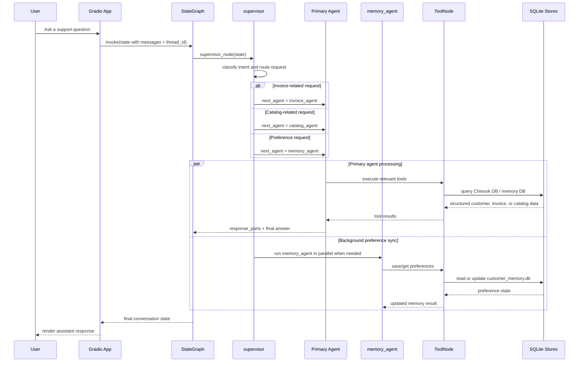

# Chinook Customer Support Agent

A multi-agent customer support assistant for a digital music store built on top of the Chinook database. The application uses a Gradio chat interface, a LangGraph supervisor, and specialist agents for invoices, catalog lookup, and saved user preferences.

## System Architecture Diagram

```mermaid
flowchart LR
    U[Customer / Browser] --> G[Gradio UI<br/>src/chinook_agent/app.py]
    G --> BG[Compiled LangGraph<br/>build_graph() in src/chinook_agent/graph.py]
    BG --> S[supervisor_node<br/>intent routing + handoff control]

    S --> IA[invoice_agent<br/>billing, invoices, customer identity]
    S --> CA[catalog_agent<br/>artists, albums, tracks, recommendations]
    S --> MA[memory_agent<br/>preferences + user memory]

    IA --> IT[ToolNode<br/>customer_lookup + invoice queries]
    CA --> CT[ToolNode<br/>catalog search + recommendations]
    MA --> MT[ToolNode<br/>save/get preferences + handoff tools]

    IT --> DB1[(Chinook SQLite DB<br/>Customer / Invoice / Track tables)]
    CT --> DB1
    MT --> DB2[(Memory SQLite DB<br/>customer_memory.db)]

    IA --> H1[transfer_to_catalog_agent<br/>transfer_to_memory_agent]
    CA --> H2[transfer_to_invoice_agent<br/>transfer_to_memory_agent]
    MA --> H3[transfer_to_invoice_agent<br/>transfer_to_catalog_agent]

    IA --> OUT[Final response in chat]
    CA --> OUT
    MA --> OUT

    S -. parallel memory sync .-> MA
```

## Request Execution Diagram



## Design Summary

The system follows a single-entry graph design:

- The Gradio app starts the compiled LangGraph graph and exposes the chat UI.
- The supervisor decides which specialist should handle the current turn.
- The selected specialist agent may call database-backed tools.
- A handoff mechanism allows agents to transfer responsibility to another specialist when needed.
- The memory agent also runs in parallel for preference-related context, ensuring saved user preferences are available while the main agent answers the request.
- The state object tracks the conversation history, preferred next agent, response fragments, and persisted memory data across turns.

## Quick Start

1. Clone and enter the repository.

```bash
git clone https://github.com/kansaram/chinook-customer-support-agent.git
cd chinook-customer-support-agent
```

2. Create a Python 3.12 virtual environment.

```bash
py -3.12 -m venv .venv
```

3. Activate the environment.

Windows PowerShell:

```powershell
.\.venv\Scripts\Activate.ps1
```

macOS/Linux:

```bash
source .venv/bin/activate
```

4. Install dependencies.

```bash
pip install -r requirements.txt
```

5. Configure environment variables.

```bash
cp .env.example .env
```

Add your `OPENAI_API_KEY` to `.env`.

## SQL script from GitHub: 
https://github.com/lerocha/chinook-database/blob/master/ChinookDatabase/DataSources/Chinook_Sqlite.sql

## Run The App

From the project root:

```bash
python src/chinook_agent/app.py
```

Default URL: `http://localhost:7860`

Optional server overrides:

- `GRADIO_SERVER_NAME`
- `GRADIO_SERVER_PORT`

Example:

```powershell
$env:GRADIO_SERVER_NAME="0.0.0.0"
$env:GRADIO_SERVER_PORT="7860"
python src/chinook_agent/app.py
```

## Verify Local Databases

List tables:

```bash
python -c "import sqlite3; c = sqlite3.connect('data/chinook.db'); print(c.execute('SELECT name FROM sqlite_master WHERE type=\"table\"').fetchall())"
```

Check customer count:

```bash
python -c "import sqlite3; c = sqlite3.connect('data/chinook.db'); print(c.execute('SELECT COUNT(*) FROM customers').fetchone())"
```

## Run Tests

```bash
pytest tests/ -v
```
To run with pytest

pip install pytest
python -m pytest tests/ -v

## Docker
Run the project using Docker
Build image:

```bash
docker build -t chinook-customer-support-agent .
```

Run container:

```bash
docker run -d -p 7860:7860 --name chinook-customer-support-agent --env-file .env chinook-customer-support-agent
```

Open: `http://localhost:7860`

## Run the Application on local

change in app.py
server_name = os.getenv("GRADIO_SERVER_NAME", "127.0.0.1")
cd .\src\chinook_agent\
python app.py


