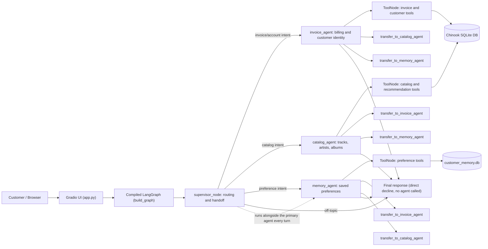
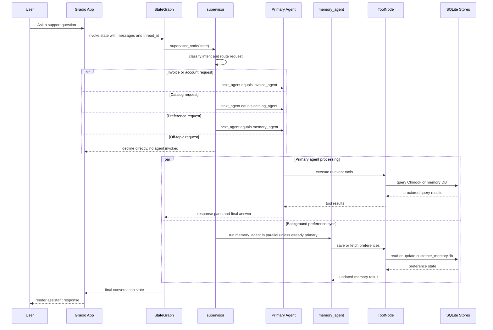

# Chinook Customer Support Agent

A multi-agent customer support assistant for a digital music store, built on the
Chinook database. The application uses a Gradio chat interface, a LangGraph
supervisor, and three specialist agents — invoices, catalog lookup, and saved
user preferences — that can hand requests off to each other mid-conversation.

## System Architecture Diagram



Each agent can hand a request to either of the other two mid-conversation — not
just the supervisor's initial routing decision. `memory_agent` also runs in the
background on every turn (unless it's already the primary agent), so a stated
preference is captured even while a different agent is answering the main
question.

## Request Execution Diagram



## Design Summary

- The Gradio app starts the compiled LangGraph graph and exposes the chat UI.
- The supervisor classifies each turn's intent and routes it to the right
  specialist, or declines directly for anything unrelated to the store.
- Any specialist agent can hand a request off to either of the other two,
  mid-conversation, when it recognizes the request isn't its job — capped to
  prevent agents looping a request back and forth.
- `memory_agent` also runs in the background on every turn to capture a stated
  preference even when a different agent is primary, and to keep saved
  preferences available across sessions.
- `response_parts` accumulates every agent's real answer within a single turn
  (not just the last one), so a mixed request — e.g. "show my invoices and
  recommend an album" — returns a complete combined answer in one reply.
- Every agent enforces grounding rules: no fabricated data, exact numbers only,
  honest "not found" responses, and no claiming a capability (refunds,
  purchases, account changes) that no tool actually supports.
- Identity is required before any account/invoice data is shared. Accepts a
  Customer ID, email, or phone number; phone numbers are digit-normalized and
  email matching is case-insensitive.

## Quick Start

1. Clone and enter the repository.

```bash
git clone https://github.com/kansaram/chinook-customer-support-agent.git
cd chinook-customer-support-agent
```

2. Create and activate a Python 3.12 virtual environment.

```bash
py -3.12 -m venv .venv
```

Windows PowerShell:
```powershell
.\.venv\Scripts\Activate.ps1
```

macOS/Linux:
```bash
source .venv/bin/activate
```

3. Install dependencies (editable install, so the `chinook_agent` package is
   importable regardless of your working directory).

```bash
pip install -r requirements.txt
pip install -e .
```

4. Configure environment variables.

```bash
cp .env.example .env
```

Add your `OPENAI_API_KEY` to `.env`. Optionally add LangSmith tracing:

```
LANGCHAIN_TRACING_V2=true
LANGCHAIN_API_KEY=your-langsmith-key
LANGCHAIN_PROJECT=chinook-customer-support-agent
```

## Database Setup

The Chinook SQLite database is **not** committed to this repo — it's built
automatically on first run (or at Docker image build time) by downloading and
executing the official schema/data script:
https://github.com/lerocha/chinook-database/blob/master/ChinookDatabase/DataSources/Chinook_Sqlite.sql

No manual setup is required for local development; `data/chinook.db` is
created the first time the app or test suite runs.

## Run the App

From the project root, with your virtual environment activated:

```bash
python src/chinook_agent/app.py
```

Default URL: `http://localhost:7860`

Optional server overrides:

```powershell
$env:GRADIO_SERVER_NAME="0.0.0.0"
$env:GRADIO_SERVER_PORT="7860"
python src/chinook_agent/app.py
```

## Verify the Local Database

List tables:

```bash
python -c "import sqlite3; c = sqlite3.connect('data/chinook.db'); print(c.execute('SELECT name FROM sqlite_master WHERE type=\"table\"').fetchall())"
```

Check customer count (note: the Chinook table is `Customer`, singular and
capitalized):

```bash
python -c "import sqlite3; c = sqlite3.connect('data/chinook.db'); print(c.execute('SELECT COUNT(*) FROM Customer').fetchone())"
```

## Run Tests

```bash
pip install pytest
python -m pytest tests/ -v
```

The suite includes `tests/test_agent_scenarios.py`, an end-to-end regression
suite that invokes the compiled graph directly to cover routing correctness,
multi-turn continuity, preference capture and deduplication, identity
verification, anti-hallucination grounding, and handoff-loop protection.
It makes real LLM calls — running it has a small OpenAI cost.

## Docker

Build the image:

```bash
docker build -t chinook-customer-support-agent .
```

Run the container:

```bash
docker run -d -p 7860:7860 --name chinook-customer-support-agent --env-file .env chinook-customer-support-agent
```

Open `http://localhost:7860`.

The Chinook database is built once during the Docker image build step (not at
container start), so container startup is fast and doesn't depend on network
access to GitHub.
