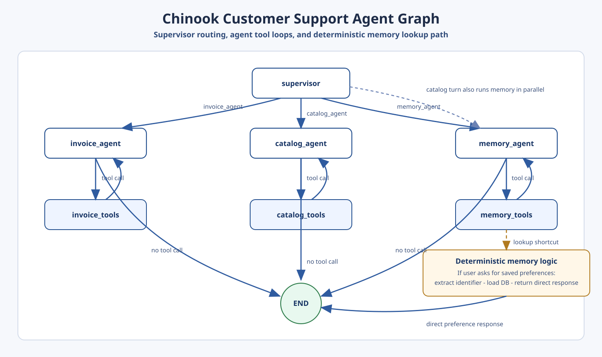
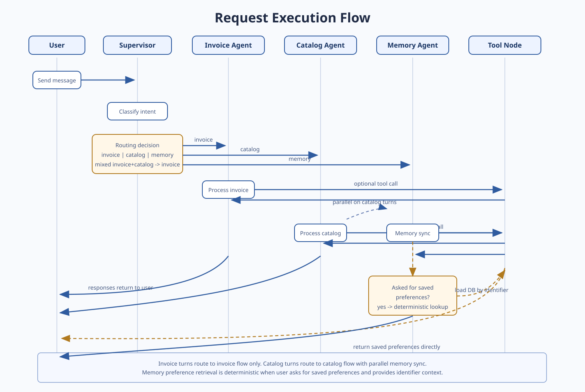

# Chinook Customer Support Agent

## Architecture Graph

Open directly: [docs/agent-architecture-diagram.svg](docs/agent-architecture-diagram.svg)

## Request Execution Flow

Open directly: [docs/request-execution-flow.svg](docs/request-execution-flow.svg)

# 1. Clone repo & enter directory
git clone https://github.com/kansaram/chinook-customer-support-agent.git
cd chinook-customer-support-agent

# 2. Create and activate a virtual environment
py -3.12 -m venv .venv
source venv/bin/activate  # On Windows: .\.venv\Scripts\Activate.ps1

# 3. Install dependencies
pip install -r requirements.txt

# 4. Set up environment variables
cp .env.example .env
# Edit .env to add your OPENAI_API_KEY

# Run your Streamlit application directly from the project root:
streamlit run app.py

# load Database locally
python -c "from database.connection import get_connection; get_connection()"

# using docker
docker build -t chinook-customer-support-agent .

# test
python -c "import sqlite3; c = sqlite3.connect('data/chinook.db'); print(c.execute('SELECT name FROM sqlite_master WHERE type=\"table\"').fetchall())"

python -c "import sqlite3; c = sqlite3.connect('data/chinook.db'); print(c.execute('SELECT COUNT(*) FROM customers').fetchone())"

# To build the Docker image, run the following command in the terminal:
#docker build -t chinook-customer-support-agent .

# To run the Docker container, use the following command:
#docker run -d -p 7860:7860 --name chinook-customer-support-agent --env-file .env chinook-customer-support-agent

# Launch the application from browser by navigating to http://localhost:7860

# Before submitting or deploying, run your automated pytest test suite to ensure all components pass:
pytest tests/ -v

